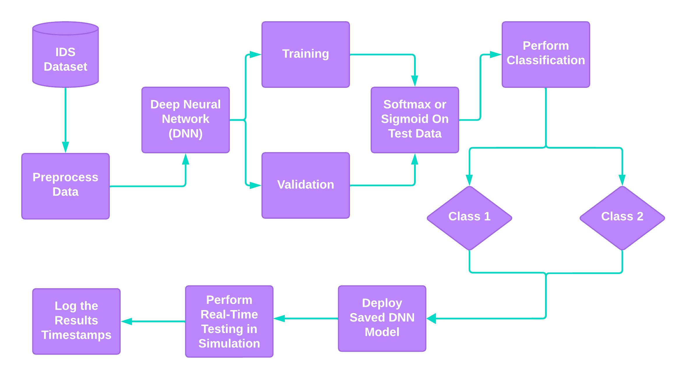

# Intelligent Real-Time Intrusion Detection System (IRIS)

**Author:** Leo Martinez III - [LinkedIn](https://www.linkedin.com/in/leo-martinez-iii/)

**Contact:** [leo.martinez@students.tamuk.edu](mailto:leo.martinez@students.tamuk.edu)

**Created:** Summer 2025

## Introduction

Real-time network intrusion detection is essential for safeguarding modern digital infrastructures. However, accurately classifying malicious traffic remains a persistent challenge, especially with the heavily imbalanced datasets often used in model training. Traditional machine learning models frequently struggle with underrepresented attack classes.

**IRIS** proposes a novel approach leveraging a Deep Neural Network (DNN) for **dimensionality reduction**, improving feature representation and computational efficiency. Unlike conventional models that rely on handcrafted feature selection, our DNN learns to automatically capture critical patterns in high-dimensional data while reducing redundancy. This dimensionality reduction minimizes detection latency, making the system suitable for real-time deployment.

The proposed framework enhances downstream classifier performance and aims to deliver faster, more effective intrusion detection. Evaluation will use benchmark datasets with a focus on classification accuracy, precision, recall, and F1 score—offering a scalable and adaptive solution to modern cybersecurity threats.

---

## Methodology

The Proposed Model Flow Chart:

### Dataset

The model uses the **UNSW-NB15** dataset, which includes 49 features and 9 attack types:
- Fuzzers
- Analysis
- Backdoors
- DoS
- Exploits
- Generic
- Reconnaissance
- Shellcode
- Worms

### Preprocessing

- **Standardization**: Applied to all numerical features to normalize scales.
- **Label Encoding**: Applied to categorical features to convert them into numerical values.

### Evaluation Metrics

To evaluate the model, we use:
- **Accuracy**
- **Precision**
- **Recall**
- **F1 Score**
- **Matthews Correlation Coefficient (MCC)**

Both class-wise and weighted metrics are computed to address the impact of class imbalance.

---

## DNN Architecture

The proposed DNN is a feedforward binary classification model with:

- **Input Layer**: Size = number of features
- **Hidden Layer 1**: 128 neurons, ReLU activation
- **Hidden Layer 2**: 64 neurons, ReLU activation
- **Output Layer**: 1 neuron, Sigmoid activation

**Training details**:
- **Loss Function**: Binary Cross-Entropy
- **Optimizer**: Adam (learning rate = 0.001)
- **Epochs**: 100
- **Batch Size**: 1024

Architecture of the Deep Neural Network (DNN) used for binary classification of network intrusions.

---

## License

This project is licensed under the MIT License. See the [LICENSE](LICENSE) file for details.

---

Here is a brief explanation of the items:
- **src:** Contains the main Python (.py) scripts for model training and evaluation (separated by sections)
- **data:** Contains data used in training (a .txt file will be in place if the dataset was too large to upload to GitHub)
- **images:** Contains the generated images from the model
- **model:** Contains the pretrained saved model that can be reused at anytime for testing purposes
- **results:** Contains model performance information
- **README.md:** Describes the purpose, structure, and requirements of the project
- **LICENSE:** Includes license details for the repository
